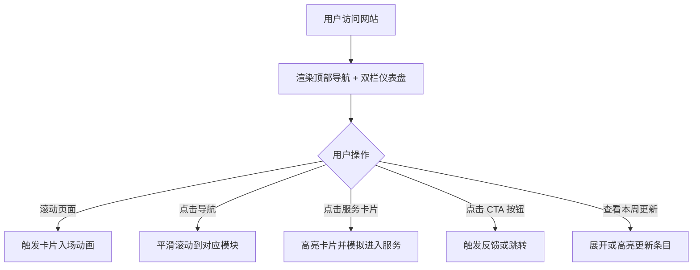

# 个人网站产品需求文档

## 1. 产品概述

一个深色主题、金色强调的个人经营中台风格门户网站。页面以「Creator Desk」为核心概念，聚合个人简介、核心数据、服务入口、内容更新与系统能力，面向访客、潜在客户与粉丝，提供一站式了解与触达入口。

目标是通过仪表盘式的信息架构与高级质感视觉，打造专业、可信、具有商业气质的个人品牌门户。

## 2. 核心功能

### 2.1 用户角色

| 角色 | 访问方式 | 核心权限 |
|------|----------|----------|
| 访客 | 直接访问 | 浏览个人资料、查看服务入口、阅读更新动态、使用联系入口 |

### 2.2 功能模块

1. **顶部导航栏**：固定顶部，包含 Logo、主导航入口、右侧 CTA 按钮，滚动后显示背景与边框。
2. **左侧创作者名片（Creator Desk）**：头像、名称、身份标签、简介、关键数据指标（粉丝、收入、项目数等）、行动按钮。
3. **Hero 主视觉区**：大标题、副标题、3D 风格装饰光环/戒指、操作按钮组。
4. **服务入口卡片**：核心服务或业务模块的卡片网格，含图标、标题、简介、价格/状态、跳转入口。
5. **本周更新 / 动态流**：时间线形式展示最近发布的内容、产品更新或公告。
6. **今日入口 / 快捷导航**：右侧辅助面板，列出常用快捷链接。
7. **核心系统介绍**：「四个系统，分别解决四类问题」式的分类展示模块。
8. **页脚**：简洁版权与联系链接。

### 2.3 页面详情

| 页面名称 | 模块名称 | 功能描述 |
|----------|----------|----------|
| 首页（单页应用） | 顶部导航栏 | 固定定位，含 Logo、导航链接、右侧「买 AI 账号」/CTA 按钮，滚动后背景变实 |
| 首页 | 左侧 Creator Desk | 头像、名字、身份标签、简介、4-6 项数据统计、主 CTA 按钮 |
| 首页 | Hero 主视觉区 | 英文小标签 + 中文大标题 + 副标题 + 操作按钮 + 右侧 3D 光环装饰 |
| 首页 | 服务入口卡片 | 4 列网格（桌面），卡片含图标、标题、描述、价格/福利、点击交互 |
| 首页 | 本周更新 | 列表式更新记录，含日期、标题、简介 |
| 首页 | 今日入口 | 右侧快捷面板，2×2 按钮网格 |
| 首页 | 核心系统 | 四列系统卡片，每个系统配标题、描述与入口 |
| 首页 | 页脚 | 版权信息、返回顶部、社交/联系链接 |

## 3. 核心流程

访客进入网站后，首先看到左侧 Creator Desk 与右侧 Hero 主视觉组成的双栏仪表盘。访客可以滚动浏览服务入口、本周更新、核心系统等模块，点击任意卡片或按钮后，页面给出交互反馈（如高亮、弹窗提示或跳转占位）。左侧名片提供持续的身份锚点与关键数据，顶部导航支持快速锚点跳转。

## 4. 用户界面设计

### 4.1 设计风格

- **主色调**：深色背景 `#0b0b0d`，卡片背景 `#141416`，分隔线 `#26262a`。
- **强调色**：暖金色 `#d4a853` 用于按钮、标签、高亮、hover 状态；米金色 `#f5e6c8` 用于重要文字与标题。
- **辅助色**：深金色描边 `#8a6d3b`，文字主色 `#e8e8e8`，次要文字 `#9ca3af`。
- **按钮样式**：金色细边框、深色填充、圆角 8px，hover 时背景变为金色并文字反色；实心金色按钮用于主 CTA。
- **字体**：
  - 标题：ZCOOL XiaoWei / Noto Serif SC（中文），配合 Cormorant Garamond（英文装饰）。
  - 正文：Noto Sans SC / system-ui，保证中文可读性。
  - 英文小标签：JetBrains Mono，增强科技感。
- **布局风格**：类仪表盘双栏布局：左侧固定窄边栏展示创作者名片，右侧主内容区自上而下排列 Hero、服务卡片、更新、系统等模块。
- **图标/装饰**：使用 lucide-react 图标；右侧 Hero 区使用 CSS 3D 旋转光环/圆环装饰；全局添加细微噪点纹理与金色光晕点缀。

### 4.2 页面设计概述

| 页面名称 | 模块名称 | UI 元素 |
|----------|----------|----------|
| 首页 | 顶部导航栏 | 深色背景、金色 Logo、居中文本链接、右侧金色 CTA 胶囊按钮 |
| 首页 | Creator Desk | 圆形头像、金色姓名、小标签、简介文本、统计数字列表、金色边框卡片 |
| 首页 | Hero 主视觉区 | 英文小标签（AI OPERATING HUB）、中文大标题、副标题、按钮组、3D 旋转光环 |
| 首页 | 服务入口卡片 | 金色图标配金色细边框卡片、标题、描述、价格、hover 光晕 |
| 首页 | 本周更新 | 左侧日期 + 右侧标题/描述的列表，hover 高亮 |
| 首页 | 今日入口 | 右侧深色卡片内 2×2 金色边框快捷按钮 |
| 首页 | 核心系统 | 四列卡片，每个系统含图标、标题、简介、金色入口 |
| 首页 | 页脚 | 极简深色底、版权文字、返回顶部按钮 |

### 4.3 响应式

- **桌面端优先（≥1280px）**：左侧固定 320px Creator Desk，右侧主内容区自适应；服务卡片 4 列；核心系统 4 列。
- **平板端（≤1024px）**：左侧边栏变为顶部可折叠卡片或隐藏为抽屉；主内容区全宽；服务卡片 2 列；核心系统 2 列。
- **移动端（≤640px）**：单栏布局，顶部汉堡菜单；Hero 文字与 3D 装饰上下堆叠；所有卡片单列；今日入口移入主内容流。
- **触控优化**：卡片 hover 效果在触屏设备上切换为 active 状态；按钮点击区域不小于 44×44px。

## 5. 动画与交互

- **页面加载**：导航栏淡入，左侧名片从左侧滑入，Hero 文字 stagger 上淡入，3D 光环持续缓慢旋转。
- **滚动触发**：各模块卡片进入视口时触发 `fade-in-up` 动画，使用 Intersection Observer 实现。
- **3D 光环**：右侧 Hero 区使用 CSS transform-style: preserve-3d 与 @keyframes 实现持续的 3D 倾斜旋转与光晕脉冲。
- **悬停效果**：导航链接金色下划线展开；服务卡片边框变亮、整体轻微上浮并出现金色光晕；按钮 hover 反色填充。
- **点击反馈**：按钮点击时有轻微缩放（scale 0.97），卡片点击时边框闪烁金色。
- **性能考虑**：动画优先使用 transform 与 opacity；3D 装饰使用纯 CSS，避免引入 heavy WebGL；Intersection Observer 仅触发一次。
