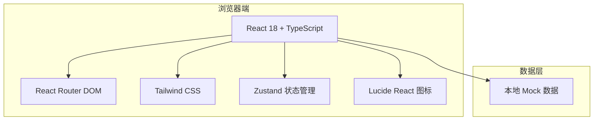

# 个人网站技术架构文档

## 1. 架构设计



## 2. 技术说明

- **前端框架**：React@18 + TypeScript
- **构建工具**：Vite@5
- **样式方案**：Tailwind CSS@3
- **初始化模板**：react-ts（纯前端模板）
- **路由**：react-router-dom（单页应用，使用锚点滚动与可选的 / 路由）
- **状态管理**：Zustand（用于项目筛选、菜单开关、表单状态等轻量状态）
- **图标库**：lucide-react
- **字体**：Google Fonts（ZCOOL XiaoWei、Cormorant Garamond、Noto Sans SC、JetBrains Mono）
- **后端**：无，联系表单仅做前端校验与模拟提交

## 3. 路由定义

| 路由 | 用途 |
|------|------|
| `/` | 单页应用主页，包含所有模块与锚点 |

页面内部通过 `id` 锚点实现模块跳转：

- `#home`
- `#about`
- `#projects`
- `#skills`
- `#experience`
- `#contact`

## 4. API 定义

本项目为纯静态前端应用，无后端 API。联系表单提交通过前端状态模拟，不产生真实网络请求。

## 5. 数据模型

### 5.1 项目数据

```typescript
interface Project {
  id: string;
  title: string;
  description: string;
  category: 'web' | 'design' | 'tool';
  tags: string[];
  image: string;
  link?: string;
}
```

### 5.2 技能数据

```typescript
interface Skill {
  name: string;
  level: number; // 1-5
  category: string;
}
```

### 5.3 经历数据

```typescript
interface Experience {
  id: string;
  title: string;
  organization: string;
  period: string;
  description: string;
}
```

### 5.4 表单数据

```typescript
interface ContactForm {
  name: string;
  email: string;
  message: string;
}
```

## 6. 项目结构

```
d:\个人网站\wangzhan
├── public/
│   └── fonts/              # 本地字体文件（可选）
├── src/
│   ├── components/         # 可复用组件
│   │   ├── Navigation.tsx
│   │   ├── CreatorDesk.tsx
│   │   ├── Hero.tsx
│   │   ├── ServiceCards.tsx
│   │   ├── Updates.tsx
│   │   ├── QuickLinks.tsx
│   │   ├── Systems.tsx
│   │   ├── Footer.tsx
│   │   ├── GoldenRing.tsx
│   │   └── ScrollReveal.tsx
│   ├── hooks/              # 自定义 Hooks
│   │   └── useScrollReveal.ts
│   ├── store/              # Zustand 状态
│   │   └── useStore.ts
│   ├── data/               # Mock 数据
│   │   └── portfolio.ts
│   ├── types/              # TypeScript 类型
│   │   └── index.ts
│   ├── App.tsx
│   ├── main.tsx
│   └── index.css
├── .trae/documents/        # 产品与技术文档
├── index.html
├── package.json
├── tailwind.config.js
├── tsconfig.json
└── vite.config.ts
```

## 7. 关键依赖

| 依赖 | 版本 | 用途 |
|------|------|------|
| react | ^18.2.0 | UI 框架 |
| react-dom | ^18.2.0 | DOM 渲染 |
| react-router-dom | ^6.x | 路由 |
| tailwindcss | ^3.4.x | 原子化 CSS |
| zustand | ^4.x | 状态管理 |
| lucide-react | ^0.x | 图标 |
| vite | ^5.x | 构建工具 |
| typescript | ^5.x | 类型系统 |
